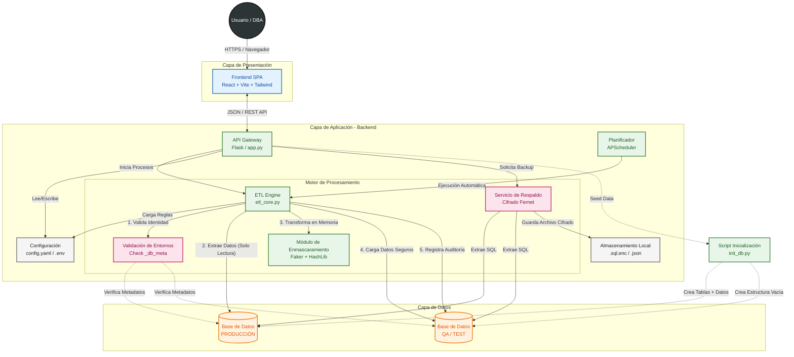

#  DataMask ETL

> Sistema automatizado de Extracción, Transformación y Carga (ETL) diseñado para la migración segura de datos sensibles desde entornos de Producción a QA, aplicando técnicas de enmascaramiento en tiempo real.


##  Visión General

DataMask ETL resuelve el problema de probar software con datos reales sin comprometer la privacidad de los usuarios. Permite sincronizar bases de datos aplicando reglas de ofuscación (hashing, nombres falsos, redacción) y cuenta con mecanismos de seguridad robustos para evitar la corrupción de datos en producción.

##  Características Principales

- **Enmascaramiento Dinámico:** Reglas configurables (Hash de emails, Faker para nombres, censura de textos).
- **Seguridad de Entornos:** Validación de huella digital (`_db_meta`) para impedir escrituras accidentales en Producción.
- **Backups Cifrados:** Generación de respaldos SQL encriptados con AES-256 (Fernet) para almacenamiento seguro.
- **Control de Roles (RBAC):**
  - **DBA:** Acceso total (Crear, Editar, Ejecutar, Respaldar, Sembrar).
  - **Desarrollador/Tester:** Solo lectura y monitoreo.
- **Data Seeding:** Generador de datos de prueba masivos utilizando `Faker`.
- **Dashboard Interactivo:** Métricas en tiempo real, historial de ejecuciones y cálculo de duración.
- **Muestreo de Datos:** Capacidad de migrar solo un porcentaje (%) de la base de datos para pruebas ligeras.

##  Tecnologías

### Frontend
- **React + Vite**: Framework principal.
- **Tailwind CSS**: Estilizado.
- **Shadcn/ui**: Componentes de interfaz modernos.
- **Lucide React**: Iconografía.

### Backend
- **Python 3.13+**: Lenguaje base.
- **Flask**: API REST.
- **SQLAlchemy + Pandas**: Manipulación y carga eficiente de datos.
- **Cryptography**: Cifrado de backups.
- **APScheduler**: Programación de tareas automáticas.

## Diagrama de arquitectura



##  Instalación y Configuración para su Ejecución Local

### 1. Backend (API Python)

1.  **Clonar el repositorio**:
    ```bash
    git clone https://github.com/JuanFranciscoRamosChavez/Proyecto-Final-ABD.git
    cd Proyecto-Final-ABD
    ```

2. **Creamos y activamos un entorno virtual**
   ```bash
   # Crear el entorno en Windows 
   python -m venv venv

   # Crear el entorno en macOS/Linux
   python3 -m venv .venv
   
   # Activar en Windows
   venv\Scripts\activate
   
   # Activar en macOS/Linux
   source venv/bin/activate
   ```
   
3.  **Instalar las dependencias**:
    ```bash
    pip install -r requirements.txt
    ```
    
4. **Configurar variables de entorno**  
   - El archivo `.env` está en `.gitignore` y viene vacío intencionadamente.  
   - Copia la información que te proporcionaremos en la documentación anteriormente entregada y coloca todo en el archivo `.env` en tu entorno de ejecución local.
   Sin esto, la aplicación no podrá conectarse correctamente.

5. **Inicializamos el servidor**
    ```bash
    python backend/app.py
    ```

### 2. Frontend (React + Vite + Tailwind)

1. **Abrimos una nueva terminal en Proyecto-Final-ABD para cargar el frontend**
   - Instalamos las dependencias:
   ```bash
    npm install
   ```
   - Iniciamos el servidor de desarrollo:
   ```bash
    npm run dev
   ```
   - Abre tu navegador en http://localhost:8080

### 3. Como decifrar el `.sql.enc`:

1. **Usamos el código creado para decifrar nuestras copias de seguridad:**

   ```bash
    python backend/restore_util.py
   ```

### Uso y Guía de Roles
Explicamos cómo entrar y qué hacer.

#### Primeros Pasos

1. **Inicializar Entornos:** Al iniciar por primera vez, ingresa como DBA y ve a *Pipelines*. Haz clic en **"Generar Datos Fuente"**. Esto creará las tablas en Producción y etiquetará las bases de datos para seguridad.
2. **Sincronizar:** Usa el botón **"Sincronizar"** para que el sistema detecte automáticamente las tablas existentes y cree los pipelines.
3. **Ejecutar:** Puedes ejecutar una migración completa o definir un porcentaje de muestreo (ej. 20%).
4. **Respaldos:** Antes de operaciones críticas, usa el botón **"Crear Respaldo"**. Se generará un archivo `.sql.enc` cifrado.
